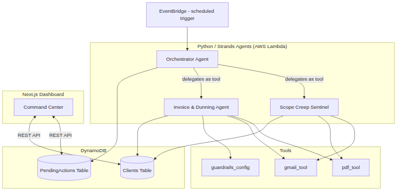

# CashflowGuardian

**An autonomous AI financial operations agent for freelancers, built on the AWS Strands Agents SDK.**

Built for the [AWS "Agents for Humans" Hackathon](https://agentsforhumans.devpost.com/) — Professional Agents Track.

> Freelancers lose income two ways: unbilled scope creep, and invoices that sit unpaid — over 50% of B2B invoices are paid past 30 days. CashflowGuardian catches both, autonomously, and only asks a human to weigh in when a real decision needs making.

---

## What It Does

CashflowGuardian runs two specialist agents under one orchestrator:

- **Scope Creep Sentinel** — reads client emails, compares requests against the stored Statement of Work, and drafts a change-order invoice the moment a "quick tweak" turns out to be unpaid extra work.
- **Invoice & Dunning Agent** — generates an invoice the instant a milestone completes, then runs a tone-controlled escalation ladder (Day+3 → Day+7 → Day+14) on anything that goes unpaid.

Every externally-visible action — every email sent, every invoice finalized — pauses for explicit human approval first. Nothing is autonomous in the sense of "unsupervised." It's autonomous in the sense of "you don't have to remember to do it."

Full system design: see [`docs/ARCHITECTURE.md`](./docs/ARCHITECTURE.md). Hackathon operating plan (judging criteria, fatal-flaw checklist, stretch goals): [`docs/BUILD_GUIDE.md`](./docs/BUILD_GUIDE.md).

---

## Why This Matters

A freelancer's real accountant would notice a request creeping outside scope, and would know exactly how firmly to word a payment reminder on day 14 versus day 3. CashflowGuardian is built to make that same judgment call, consistently, without the freelancer having to be the one to bring it up.

---

## Tech Stack

| Layer | Technology |
|---|---|
| Agent framework | [Strands Agents SDK](https://github.com/strands-agents) (Python) |
| LLM | Amazon Bedrock (Claude Haiku for classification, Claude Sonnet for drafting) |
| Memory | Strands Memory backed by DynamoDB |
| Document generation | ReportLab |
| Email | Gmail API |
| Deployment | AWS Lambda + EventBridge, defined via SAM (`infra/template.yaml`) |
| Frontend | Next.js + Tailwind CSS |
| Tone guardrails | Constrained system prompts + a `guardrails_config` tone-check tool (optionally backed by Amazon Bedrock Guardrails) |

---

## Architecture



EventBridge invokes the Orchestrator Lambda on a schedule; the Orchestrator
delegates to the Scope Creep Sentinel and Invoice & Dunning agents as Strands
tools. They use ReportLab PDF generation, Gmail, and deterministic tone
guardrails, and read/write the DynamoDB memory layer (`Clients`,
`PendingActions`). A stateless REST API (`lambda_handlers/api_handler.py`)
connects the Next.js Command Center to the same human-in-the-loop state machine.
Full design: [`docs/ARCHITECTURE.md`](./docs/ARCHITECTURE.md).

---

## Project Structure

```
strands-cashflow-guardian/
├── docs/                # Architecture reference + build guide
├── agents/              # Orchestrator + specialist agents + tools
├── memory/              # DynamoDB schema and Strands Memory adapter
├── lambda_handlers/     # Lambda entry points: scheduled check + dashboard REST API
├── infra/               # SAM template, deploy script, IAM policies
├── frontend/            # Next.js Command Center dashboard
├── scripts/             # Demo-data seeding + local API server
├── tests/               # Unit tests per agent + handler tests
└── demo/                # Video script and architecture diagram assets
```

---

## Getting Started

### Prerequisites
- Python 3.11+
- Node.js 18+ (for the frontend)
- An AWS account with Bedrock model access enabled for Claude
- AWS CLI and SAM CLI (user-local install is fine — no root required)
- A Gmail account for sandboxed testing (not your primary inbox)
- Docker (optional — only for Mode B's DynamoDB Local)

### 1. Clone and set up the environment

```bash
git clone https://github.com/eojuma/strands-cashflow-guardian.git
cd strands-cashflow-guardian
python -m venv .venv
source .venv/bin/activate
pip install -r requirements.txt
cp .env.example .env
```

Fill in `.env` top-to-bottom (each blank field has a comment saying where the
value comes from): §1 AWS region, §2 AWS identity (or leave blank if using
`~/.aws`), §3 Bedrock model id, §4 Gmail (optional for dry runs). The seed and
local API scripts load `.env` automatically. Never commit `.env`.

### 2. Request Bedrock model access

In the AWS Console, go to Bedrock → Model access, and request access to the Claude models used in this project. This can take a few minutes to be approved.

### 3. Set up Gmail API credentials

1. Create a project in [Google Cloud Console](https://console.cloud.google.com/).
2. Enable the Gmail API.
3. Create OAuth client credentials (Desktop app type).
4. Download the credentials JSON and reference its path in `.env`.
5. Run the local auth flow once to generate a token (see `agents/tools/gmail_tool.py` for the first-run script).

> For demos and dry runs you can skip Gmail entirely: set `CASHFLOW_SEND_MODE=log`
> in `.env` and approved sends are logged instead of emailed.

### 4a. Run the system locally

There are three ways to run it. Start with Mode A (UI only, zero setup), then
Mode B if you want real, persistent backend state.

> **"I only see the seeded desk — where is the backend?"** That is Mode A below.
> When the dashboard shows the amber *"Live API unavailable"* banner it means no
> REST API is reachable, so it is showing a static, browser-only review desk.
> Start a backend (Mode B or C) and the banner disappears.

#### Mode A — UI preview only (no backend)

```bash
cd frontend
cp .env.local.example .env.local
npm install
npm run dev          # http://localhost:3000
```

Shows the seeded review desk (five personas, four pending approvals). Approvals
here are local to the browser and are not persisted.

#### Mode B — full local backend (recommended; no AWS account needed)

Uses Docker to run DynamoDB Local on port **8001**, so the API server keeps the
default port **8000**.

1. Create and fill `.env` (region + identity; see file comments), then uncomment
   the DynamoDB Local endpoint:

   ```bash
   cp .env.example .env        # DYNAMODB_ENDPOINT_URL=http://localhost:8001
   ```

2. Start DynamoDB Local (Docker):

   ```bash
   docker run -d --name cashflow-dynamo -p 8001:8000 amazon/dynamodb-local
   ```

3. Terminal 1 — create the tables + seed personas, then start the API:

   ```bash
   python scripts/seed_demo_data.py --reset
   python scripts/serve_api.py          # http://localhost:8000
   ```

   Sanity check (Terminal 2):

   ```bash
   curl -s http://localhost:8000/clients    # -> JSON for the 5 personas
   ```

4. Terminal 3 — frontend:

   ```bash
   cd frontend
   cp .env.local.example .env.local
   npm install
   npm run dev                          # http://localhost:3000
   ```

   The dashboard proxies `/api/*` to `localhost:8000` in dev. Use **Run
   scheduled check** to trigger a pass instantly (the deployed EventBridge rule
   does this automatically every 15 minutes), then **Approve / Edit / Reject**.
   Approving persists to DynamoDB and lands in the Activity Log — refresh to
   confirm. Stop DynamoDB Local later with `docker rm -f cashflow-dynamo`.

Notes:

- **Backend first.** Start `serve_api.py` before the frontend so the first load
  connects; otherwise the page falls back to the seeded desk until you click
  **Try live data**.
- **Ports:** DynamoDB Local = `8001`, local API = `8000`, dashboard = `3000`.
- **Scope scan needs Gmail.** Without Gmail credentials (§4 of `.env`) the
  scheduled check runs dunning + milestone invoicing but skips the Scope
  Sentinel scan.
- **Mark milestone complete** works only when a live backend is reachable.

#### Mode C — frontend against a deployed API

See §4b (deploy) and §5: set `NEXT_PUBLIC_API_BASE_URL` in
`frontend/.env.local` to the `ApiEndpoint` URL printed by `deploy.sh`.

### 4b. Deploy infrastructure

```bash
cd infra
./deploy.sh                          # `sam deploy`; see script for options
```

This provisions DynamoDB tables, the scheduled Orchestrator Lambda (EventBridge),
and the dashboard REST API via AWS SAM. It does **not** deploy the frontend —
host it on Vercel or Amplify and point `NEXT_PUBLIC_API_BASE_URL` at the printed
API endpoint. Deploy uses your `~/.aws` identity (or `AWS_PROFILE`), not `.env`;
optional overrides are `STACK_NAME` and `SEND_MODE` (default `log`).

Packaging is **offline**: `scripts/build_lambda_package.py` copies the runtime
dependency closure from your project `.venv` (pruning the unused Gmail discovery
docs) into `.lambda_build`, so `deploy.sh` needs no Docker and no PyPI access.
Just make sure the deps are installed first (`pip install -r requirements.txt`).

### 5. Frontend against the deployed API (Mode C)

> Running locally instead? Use Mode A (UI preview) or Mode B (full local
> backend) in §4a — those do not need a deployment.

```bash
cd frontend
# set NEXT_PUBLIC_API_BASE_URL to the API endpoint printed by deploy.sh
cp .env.local.example .env.local
npm install
npm run dev                          # or: npm run build && npm start
```

Open `http://localhost:3000` to view the Command Center dashboard.

---

## Running Tests

```bash
python -m pytest -q
```

The suite uses Moto for DynamoDB and needs no AWS credentials.

## Current Implementation Status

Implemented and covered locally: the Strands specialist agents, deterministic
dunning and scope classification, PDF/Gmail tools, DynamoDB memory,
milestone-to-invoice proposals, the human-in-the-loop approval state machine,
the scheduled-check and dashboard REST API handlers, the Next.js Command Center
(with an offline seeded-desk fallback), the least-privilege SAM template, demo
personas, and the deterministic end-to-end dry run.

Still requiring external configuration or manual completion: live Bedrock/AWS
smoke testing, Gmail OAuth and real sends, public frontend hosting, the final
architecture image, the recorded demo video, and the Devpost submission.

---

## Human-in-the-Loop Design

No agent in this system sends an email, finalizes an invoice, or takes any other externally-visible action without first appearing in the dashboard's **Pending Approvals** panel for a human to **Approve**, **Edit**, or **Reject**. This is a hard architectural constraint, not a configurable setting — see `docs/ARCHITECTURE.md` §7 for how the state machine enforces it.

---

## What's Next

- GitHub webhook integration for automatic milestone detection (replacing the manual trigger)
- Direct QuickBooks / Xero integration via MCP
- Multi-currency and cross-border VAT handling
- Live OpenTelemetry tracing streamed to the dashboard

---

## License

Licensed under the MIT License. See [`LICENSE`](./LICENSE) for details.

---

## Hackathon Submission

- **Track:** Professional Agents
- **Event:** AWS "Agents for Humans" Hackathon
- Architecture diagram: [`demo/architecture-diagram.png`](./demo/architecture-diagram.png) (source: [`docs/ARCHITECTURE.md`](./docs/ARCHITECTURE.md))
- Demo narration/shot list: [`demo/video_script.md`](./demo/video_script.md)
- Demo video: _link added at submission_