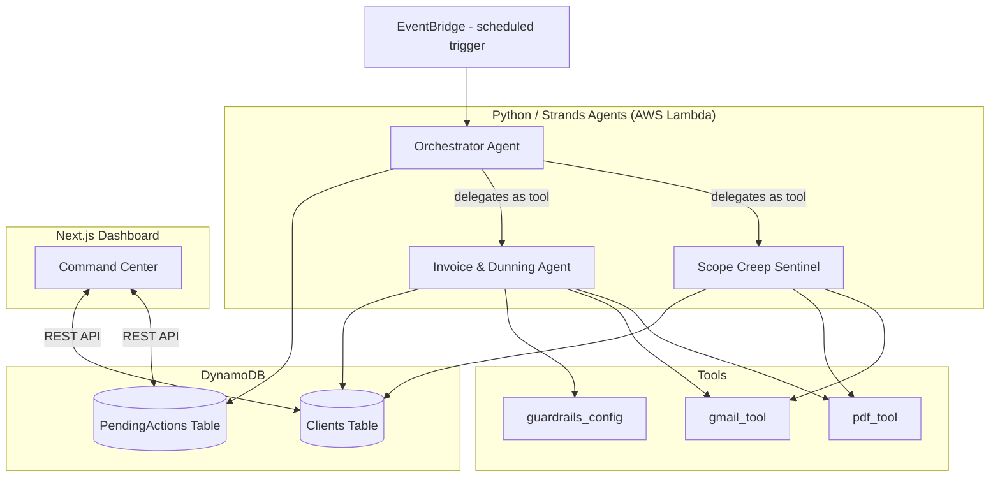

# CashflowGuardian — Architecture & Build Reference

This document is written so that someone with no prior context could read it top to bottom and build the system. It goes deeper than a high-level diagram: it includes the full project structure, exact data schemas, agent interfaces, state machine definitions, and the sequence of calls for every major flow.

For the hackathon-specific operating plan — the judging-criteria mapping, the fatal-flaw prevention checklist, and the stretch-goal priority order referenced throughout the build issues — see [`BUILD_GUIDE.md`](./BUILD_GUIDE.md).

---

## Table of Contents

- [CashflowGuardian — Architecture \& Build Reference](#cashflowguardian--architecture--build-reference)
  - [Table of Contents](#table-of-contents)
  - [1. System Overview](#1-system-overview)
  - [2. Full Project Structure](#2-full-project-structure)
  - [3. System Diagram](#3-system-diagram)
  - [4. Data Model](#4-data-model)
    - [4.1 `Clients` Table (DynamoDB)](#41-clients-table-dynamodb)
    - [4.2 `PendingActions` Table (DynamoDB)](#42-pendingactions-table-dynamodb)
  - [5. Agent Specifications](#5-agent-specifications)
    - [5.1 Orchestrator Agent — `agents/orchestrator.py`](#51-orchestrator-agent--agentsorchestratorpy)
    - [5.2 Scope Creep Sentinel — `agents/scope_sentinel.py`](#52-scope-creep-sentinel--agentsscope_sentinelpy)
    - [5.3 Invoice \& Dunning Agent — `agents/invoice_dunning.py`](#53-invoice--dunning-agent--agentsinvoice_dunningpy)
  - [6. Tool Specifications](#6-tool-specifications)
  - [7. Human-in-the-Loop State Machine](#7-human-in-the-loop-state-machine)
  - [8. Sequence Flows](#8-sequence-flows)
    - [8.1 Flow: Milestone Complete → Invoice Sent](#81-flow-milestone-complete--invoice-sent)
    - [8.2 Flow: Overdue Invoice → Escalation](#82-flow-overdue-invoice--escalation)
    - [8.3 Flow: Scope Creep Detected](#83-flow-scope-creep-detected)
  - [9. Frontend ↔ Backend Contract](#9-frontend--backend-contract)
  - [10. Deployment Architecture](#10-deployment-architecture)
  - [11. Error Handling \& Edge Cases](#11-error-handling--edge-cases)
  - [12. Explicit Scope Boundaries (MVP)](#12-explicit-scope-boundaries-mvp)

---

## 1. System Overview

CashflowGuardian is a multi-agent system with three logical actors:

- **Orchestrator Agent** — the only agent that talks to the outside triggers (EventBridge) and the only agent allowed to move a proposed action from "drafted" to "executed." It owns the human-in-the-loop state machine.
- **Scope Creep Sentinel Agent** — a specialist the Orchestrator delegates to when new client communication arrives. Detects out-of-scope requests.
- **Invoice & Dunning Agent** — a specialist the Orchestrator delegates to for milestone-to-invoice generation and overdue-payment escalation.

Both specialists are implemented as **Strands tools** callable by the Orchestrator (the "agents-as-tools" pattern), not as independently-triggered processes. This is a deliberate design choice: it keeps a single, auditable point of control for anything that reaches a real client, and it's the clearest way to demonstrate genuine multi-agent orchestration to a judge reading the code.

**Two-layer execution model.** The system deliberately separates *where the agent decides* from *where the code executes*. The scheduled trigger is deterministic: it starts the Orchestrator agent with a fixed task, then deterministically persists whatever the agent proposes. The agent is genuinely agentic in between — its reasoning loop chooses which sub-agent tools to invoke, and the LLM invokes the low-level `@tool` functions. The approval/execution path is fully deterministic and never re-invokes the LLM, so what a human approves is byte-for-byte what gets sent. This split is what makes "autonomous but supervised" enforceable rather than aspirational.

---

## 2. Full Project Structure

```
strands-cashflow-guardian/
│
├── README.md
├── LICENSE
├── requirements.txt
├── .env.example
├── .gitignore
│
├── docs/
│   ├── architecture.md            # This document
│   └── BUILD_GUIDE.md             # Judging-criteria map, fatal-flaw checklist, stretch goals
│
├── agents/
│   ├── __init__.py
│   ├── orchestrator.py              # Entry point; owns state machine; delegates to sub-agents
│   ├── scope_sentinel.py            # Scope Creep Sentinel agent definition
│   ├── invoice_dunning.py           # Invoice & Dunning agent definition
│   └── tools/
│       ├── __init__.py
│       ├── pdf_tool.py              # generate_invoice_pdf(), generate_change_order_pdf()
│       ├── gmail_tool.py            # read_recent_emails(), send_email()
│       └── guardrails_config.py     # apply_tone_guardrail(draft_text) -> safe_text
│
├── memory/
│   ├── __init__.py
│   ├── schema.py                    # Table + attribute definitions (source of truth)
│   └── dynamo_client.py             # get_client(), update_client(), get_pending_actions(),
│                                     # create_pending_action(), update_action_status(),
│                                     # update_action_content()
│
├── lambda_handlers/
│   ├── orchestrator_handler.py      # Lambda entry point wrapping agents/orchestrator.py
│   ├── scope_sentinel_handler.py    # (only needed if deployed as separate function)
│   └── invoice_dunning_handler.py   # (only needed if deployed as separate function)
│
├── infra/
│   ├── template.yaml                # AWS SAM template: Lambda, EventBridge, DynamoDB, IAM
│   ├── deploy.sh                    # One-command deploy wrapper around `sam deploy`
│   └── iam-policies/
│       └── lambda-execution-role.json
│
├── frontend/
│   ├── package.json
│   ├── next.config.js
│   ├── app/
│   │   ├── layout.tsx
│   │   ├── page.tsx                 # Composes the three dashboard panels
│   │   └── components/
│   │       ├── ClientsPanel.tsx
│   │       ├── ApprovalsPanel.tsx
│   │       └── ActivityLog.tsx
│   └── lib/
│       └── api.ts                   # Fetch wrappers calling backend endpoints (see §9)
│
├── scripts/
│   └── seed_demo_data.py            # Populates DynamoDB with 3-5 synthetic clients
│
├── tests/
│   ├── test_orchestrator.py
│   ├── test_scope_sentinel.py
│   ├── test_invoice_dunning.py
│   └── test_dynamo_client.py
│
├── credentials/                     # gitignored — Gmail OAuth files live here
│
└── demo/
    ├── video_script.md
    └── architecture-diagram.png
```

**Rule of thumb while building:** if you're about to create a file not listed here, stop and ask whether it belongs in an existing file instead. Every file above earns its place by being referenced in a specific flow below — that's what keeps a solo 23-day build from sprawling.

---

## 3. System Diagram



---

## 4. Data Model

### 4.1 `Clients` Table (DynamoDB)

| Attribute | Type | Notes |
|---|---|---|
| `client_id` (PK) | String | UUID, e.g. `client_001` |
| `name` | String | Display name |
| `email` | String | Client's contact email |
| `sow_terms` | String (JSON) | Structured SOW: deliverables, hourly rate, included revision count |
| `billing_rate` | Number | Hourly or per-milestone rate in USD |
| `payment_history` | List<Map> | `[{invoice_id, amount, due_date, paid_date, status}]` |
| `tone_log` | List<Map> | `[{date, escalation_tier, summary}]` — used so the agent never re-escalates inconsistently |
| `created_at` | String (ISO 8601) | |
| `updated_at` | String (ISO 8601) | |

### 4.2 `PendingActions` Table (DynamoDB)

| Attribute | Type | Notes |
|---|---|---|
| `action_id` (PK) | String | UUID |
| `client_id` (GSI) | String | Foreign key into Clients table |
| `action_type` | String | `invoice`, `change_order`, `dunning_email` |
| `escalation_tier` | String or null | `day_3`, `day_7`, `day_14` — only set for dunning actions |
| `drafted_content` | String | The full email/invoice text or PDF reference the agent proposes to send |
| `agent_reasoning` | String | Human-readable explanation — this feeds the Activity Log panel directly |
| `status` | String | `pending`, `approved`, `edited`, `rejected`, `executed` |
| `created_at` | String (ISO 8601) | |
| `resolved_at` | String (ISO 8601) or null | Set when status leaves `pending` |

**Why `agent_reasoning` is its own field, not buried in logs:** the Scope Sentinel's value proposition *is* its reasoning — a judge (and the dashboard) needs to read "flagged because this request adds ~3 hours beyond the two-revision limit in the SOW," not just see a generated invoice with no explanation attached.

---

## 5. Agent Specifications

### 5.1 Orchestrator Agent — `agents/orchestrator.py`

**Responsibilities:**
- **Scheduled path (deterministic shell):** EventBridge invokes `orchestrator_handler`, which starts the Orchestrator Strands agent with a fixed task ("run scheduled check").
- **Agentic delegation (inside the run):** the Orchestrator's reasoning loop invokes the two sub-agents as Strands tools — `scope_sentinel.check_inbox()` and `invoice_dunning.check_due_dates()` — which in turn call the low-level `@tool` functions (`pdf_tool`, `gmail_tool`, `guardrails_config`) as the LLM deems necessary.
- **Persistence (deterministic, after the run):** the wrapper collects every proposed action the agent produced and writes each to `PendingActions` with `status=pending`. Nothing is executed on this path.
- **Resolution path (deterministic, never agentic):** on the dashboard's Approve/Edit/Reject call, `resolve_action` reads the stored record, applies the decision, and `execute_action` runs only after re-reading a persisted `status ∈ {approved, edited}`. The LLM is **not** re-invoked at execution time — the drafted (or edited) content is sent exactly as stored.

**Pseudocode:**
```python
# ---- Scheduled path: deterministic shell, agentic core ----
def run_scheduled_check():
    # 1) Start the Orchestrator Strands agent. Its reasoning loop invokes
    #    scope_sentinel.check_inbox() and invoice_dunning.check_due_dates()
    #    as registered tools, returning proposed-action records.
    proposed = orchestrator_agent.run(task="run scheduled check")

    # 2) Deterministic persistence — nothing is executed here.
    for action in proposed:
        dynamo_client.create_pending_action(action)   # status='pending'

# ---- Resolution path: deterministic, never re-runs the LLM ----
def resolve_action(action_id, decision, edited_content=None):
    action = dynamo_client.get_pending_action(action_id)
    if action["status"] != "pending":
        return  # idempotent: already resolved, no side effects

    if decision == "rejected":
        dynamo_client.update_action_status(action_id, "rejected")
        return

    if decision == "approved":
        dynamo_client.update_action_status(action_id, "approved")
    elif decision == "edited":
        dynamo_client.update_action_content(action_id, edited_content)
        dynamo_client.update_action_status(action_id, "edited")
    else:
        return  # unknown decision — no side effects

    execute_action(action_id)


def execute_action(action_id):
    action = dynamo_client.get_pending_action(action_id)
    if action["status"] not in ("approved", "edited"):
        return  # hard guard — the §7 invariant

    if action["action_type"] in ("invoice", "change_order", "dunning_email"):
        gmail_tool.send_email(action["client_id"], action["drafted_content"])
    dynamo_client.update_action_status(action_id, "executed")
```

### 5.2 Scope Creep Sentinel — `agents/scope_sentinel.py`

**Responsibilities:**
- `check_inbox()`: fetches recent unread emails via `gmail_tool.read_recent_emails()`.
- For each email, prompts the LLM with the email content + the client's `sow_terms` from memory, asking it to classify: in-scope / out-of-scope, and if out-of-scope, estimate extra hours.
- If out-of-scope, calls `pdf_tool.generate_change_order_pdf()` and returns a proposed `PendingActions` record with `agent_reasoning` populated.

**Interface:**
```python
def check_inbox() -> list[dict]:
    """Returns a list of proposed PendingActions records, or empty list if nothing flagged."""
```

### 5.3 Invoice & Dunning Agent — `agents/invoice_dunning.py`

**Responsibilities:**
- `check_due_dates()`: for every client, checks `payment_history` for:
  - A milestone marked complete with no invoice yet generated → propose `invoice` action.
  - An unpaid invoice past due date → determine escalation tier (day_3 / day_7 / day_14) based on days overdue and `tone_log` (never re-send the same tier twice), draft the appropriate email, apply `guardrails_config.apply_tone_guardrail()`, and return a `dunning_email` proposed action.

**Interface:**
```python
def check_due_dates() -> list[dict]:
    """Returns proposed PendingActions records for new invoices and/or dunning escalations."""
```

---

## 6. Tool Specifications

| Tool | Function | Signature |
|---|---|---|
| `pdf_tool.py` | `generate_invoice_pdf` | `(client_id: str, amount: float, due_date: str) -> str` (returns file path or S3 key) |
| `pdf_tool.py` | `generate_change_order_pdf` | `(client_id: str, description: str, extra_hours: float) -> str` |
| `gmail_tool.py` | `read_recent_emails` | `(since: datetime) -> list[dict]` (each dict: sender, subject, body, received_at) |
| `gmail_tool.py` | `send_email` | `(to: str, subject: str, body: str) -> bool` |
| `guardrails_config.py` | `apply_tone_guardrail` | `(draft_text: str, tier: str) -> str` (returns rewritten text if original fails the tone check) |

Each of these is registered with Strands via the `@tool` decorator so the LLM invokes them as part of its reasoning loop — not called directly by orchestration code. This distinction matters for the "Technological Implementation" judging criterion.

---

## 7. Human-in-the-Loop State Machine

```
        ┌─────────┐
        │ pending │◄── created by Orchestrator after agent proposes action
        └────┬────┘
             │
   ┌─────────┼─────────┐
   ▼         ▼         ▼
approved   edited   rejected
   │         │         │
   └────┬────┘         ▼
        ▼          (no side effects,
    executed        action discarded)
```

**Hard rule enforced in code, not just convention:** `execute_action()` in the Orchestrator must never be reachable from any code path except one that has first read `status in ("approved", "edited")` from DynamoDB. This is the single most important invariant in the whole system — it's what makes "autonomous but supervised" true rather than aspirational.

---

## 8. Sequence Flows

### 8.1 Flow: Milestone Complete → Invoice Sent

1. Human clicks "Mark Milestone Complete" on dashboard (MVP trigger; GitHub webhook is a stretch goal).
2. API writes a milestone-complete flag to the client's record.
3. On next Orchestrator run, `invoice_dunning.check_due_dates()` detects it, calls `pdf_tool.generate_invoice_pdf()`.
4. Orchestrator writes a `pending` action with the generated invoice.
5. Dashboard's Approvals panel shows it.
6. Human clicks Approve.
7. Orchestrator calls `gmail_tool.send_email()` with the invoice attached, sets status to `executed`, updates `payment_history` in the Clients table.

### 8.2 Flow: Overdue Invoice → Escalation

1. Orchestrator run detects an invoice is 8 days past due.
2. Checks `tone_log` — confirms no `day_7` email has been sent yet for this invoice.
3. Drafts a formal overdue notice with late fee calculated from `billing_rate`.
4. Passes draft through `guardrails_config.apply_tone_guardrail()`.
5. Writes `pending` action with `escalation_tier=day_7`.
6. Human approves (or edits wording) on dashboard.
7. Orchestrator sends email, appends to `tone_log` so the same tier is never re-triggered.

### 8.3 Flow: Scope Creep Detected

1. Orchestrator run calls `scope_sentinel.check_inbox()`.
2. New email found: "Hey, can you also add a dark mode toggle real quick?"
3. Sentinel compares against `sow_terms` (which specifies "2 rounds of revisions, UI features as listed in Appendix A").
4. LLM classifies this as out-of-scope, estimates 3 extra hours at `billing_rate`.
5. `pdf_tool.generate_change_order_pdf()` produces the invoice.
6. Proposed action includes `agent_reasoning`: "Dark mode toggle not listed in Appendix A scope; estimated 3 hours at $75/hr = $225 change order."
7. Human reviews reasoning on dashboard, approves.
8. Orchestrator sends the change-order email with attached PDF.

---

## 9. Frontend ↔ Backend Contract

The frontend needs a minimal REST surface. If not building a separate API Gateway layer, a simple set of Lambda Function URLs or a lightweight API Gateway in front of `lambda_handlers/` is sufficient.

| Endpoint | Method | Purpose |
|---|---|---|
| `/clients` | GET | List all clients with summary status |
| `/actions/pending` | GET | List all `pending` actions (for Approvals panel) |
| `/actions/{action_id}/resolve` | POST | Body: `{decision: "approved" \| "edited" \| "rejected", edited_content?: string}` |
| `/activity-log` | GET | Returns recent resolved actions + their `agent_reasoning`, for the Activity Log panel |
| `/clients/{client_id}/milestone-complete` | POST | MVP manual trigger for milestone completion |

Keep this contract this small. Every additional endpoint is additional Phase 3 surface area you don't have slack for.

---

## 10. Deployment Architecture

- **Compute:** Each Lambda handler in `lambda_handlers/` wraps the corresponding function in `agents/`. A single `orchestrator_handler.py` is sufficient for MVP — the sub-agents are invoked in-process as Strands tools by the Orchestrator's reasoning loop (not as separate Lambda invocations or network calls), while the wrapper around the run stays deterministic: it persists proposed actions and executes only those whose persisted status is `approved` or `edited`.
- **Trigger:** One EventBridge rule on a fixed schedule (`rate(15 minutes)` is a reasonable default) invokes `orchestrator_handler.py`.
- **Storage:** Two DynamoDB tables (`Clients`, `PendingActions`), both defined in `infra/template.yaml`.
- **IAM:** A single execution role scoped to exactly: read/write on the two DynamoDB tables, `bedrock:InvokeModel` on the specific Claude model ARNs in use, and no broader permissions. Avoid `dynamodb:*` or `bedrock:*` wildcards — a judge reading your IAM policy as part of "Technological Implementation" will notice the difference.
- **Frontend hosting:** Vercel or Amplify Hosting both work; this is a secondary concern relative to backend correctness.

---

## 11. Error Handling & Edge Cases

Build these in, don't leave them as "would be nice":

- **Gmail API rate limits / auth token expiry** — wrap `gmail_tool` calls in retry-with-backoff; if the token has expired, fail loudly in logs rather than silently skipping a check.
- **Duplicate escalation prevention** — the `tone_log` check in §8.2 step 2 is not optional. Without it, a bug could send the same overdue notice repeatedly on every 15-minute Orchestrator run.
- **LLM misclassification** — the Scope Sentinel will occasionally get in-scope/out-of-scope wrong. This is exactly why nothing auto-sends: a human catches this at the approval step, and it's worth saying so explicitly in your demo video as a feature, not hiding it as a limitation.
- **Empty states** — dashboard should render sensibly with zero pending actions ("All caught up") rather than a blank panel; this is a 10-minute fix that meaningfully improves the "complete product experience" impression.

---

## 12. Explicit Scope Boundaries (MVP)

Documented here so it's unambiguous what "done" means for the hackathon submission:

- **No real payment processing.** Invoices are generated and tracked; they are not paid through the system. Stripe integration is future work.
- **No GitHub webhook.** Milestone completion is a manual dashboard action for MVP.
- **No custom Agent2Agent protocol.** Strands' native agents-as-tools pattern is used for orchestration.
- **No full distributed tracing.** The Activity Log panel plus `agent_reasoning` fields achieve the same transparency goal without the OpenTelemetry infrastructure.

If time remains after Day 18's dry run, see [`BUILD_GUIDE.md` §8](./BUILD_GUIDE.md#8-stretch-goal-priority-order) for stretch-goal priority order — do not pull these boundaries forward without finishing the MVP flows first.